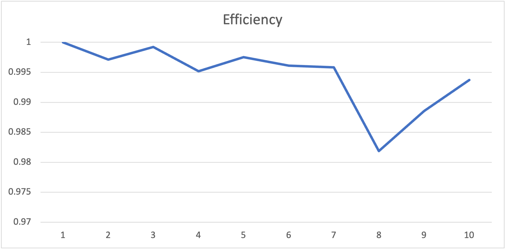

## Running ##
To compile and run from command line if you are not on windows:
```
cd src
mpicxx main.cpp CStopWatch.cpp
./a.out
```
or
```
cd Default && make all
```

To compile and run with Docker issue the following commands from the root of the project (not in the Default folder):
```
docker run --rm -v ${PWD}:/tmp -w /tmp/Default rgreen13/alpine-mpi-boost make all
docker run --rm -v ${PWD}:/tmp -w /tmp/Default rgreen13/alpine-mpi-boost mpiexec --allow-run-as-root -n X MPI
```
where `X` is the number of nodes

## Using OSC ##
Move all the files to the Ohio Supercomputing Center (OSC) server of your choice. Make sure to build your code, then modify the `jobScript` accordingly. Submit from inside the `Default` directory using 
```
qsub jobScript
```

You may also do this using http://ondemand.osc.edu

## Summary ##
This project is a parallel implementation of an algorithmn for computing pi. I used boost because the syntax is much more pleasing to my eye. In order to get the results from all the processes I changed the original calcPi() function so that it returned numInCircle this effectively split the for loop evenly between the worker and all that was left was for the master to gather all the local results and calculate pi. I used send() and recv() for communication with the workers and master processes.
## Speedup ##


Speedup is a measure of how many times faster your code executes with more processes.

My speedup results were excellent. Spliting up the for loop between the workers and master gave me almost exactly linear speedup. 

## Efficiency ##


Efficiency is a measure of how much of your resources are in use during runtime.
My efficiency is very close to 1 meaning that my code has excellent utilization.

## Karp-Flatt ##


The Karp-Flatt metric is a measure of parallelization in your code. The lower the value the better the parallelization.